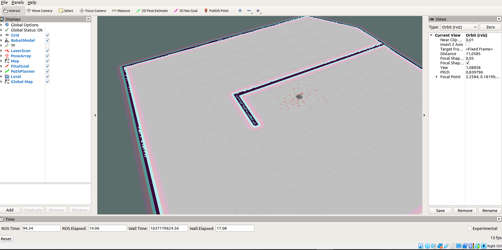

# ROS_self_navigating_bot
demo of a self-navigating robot with global and local map planning using Rviz gazebo and ROS

the commands required to run the package are the following:

Your Rviz should look like this:

