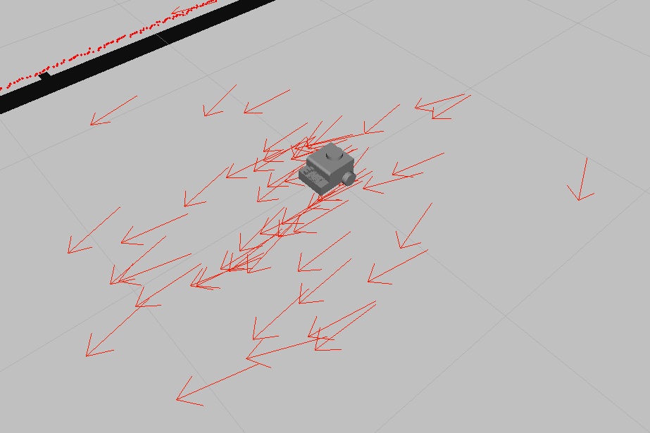
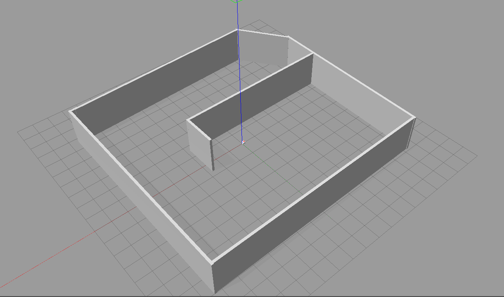
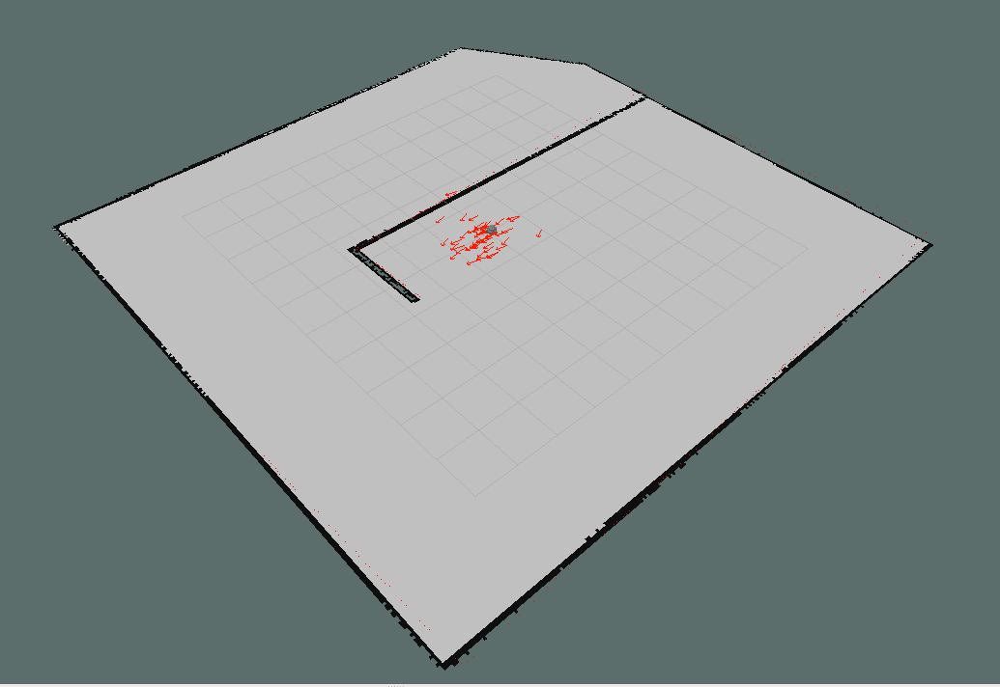

# ROS_self_navigating_bot

Youtube demo: https://www.youtube.com/watch?v=pKedwtdQNO4

This is a demo of a self-navigating robot with global and local map planning using Rviz, gazebo and ROS.

In order to launch the robot in the simulator:
    
    /your_ros_ws/src/rmp_bot_description $ roslaunch rmp_bot_description gazebo.launch

    /your_ros_ws/src/rmp_bot_description $ roslaunch rmp_bot_description display.launch

    /your_ros_ws/src/rmp_bot_description/launch $ rosrun map_server map_server rmp_world.yaml

    /your_ros_ws/src/rmp_bot_description $ roslaunch  rmp_bot_description rmp_amcl.launch

    /your_ros_ws/src/rmp_bot_description/launch $ roslaunch  rmp_bot_description movebase.launch

<!--  -->

Your Rviz should look like this:

The little robot you see is a Differential Drive robot designed in Fushion 360 and transformed into a URDF to be used in gazebo.

It was designed as simple as posible for demonstration purposes.

In order to make this the navigation ros package was used along side with: Gmapping, Map_server, AMCL, Move_base, Navigation, Control, Slam.

As a result, the following robot that can navigate itself to a 2D goal given through Rviz by the user in a map that is being published by the mas_server package.Furthermore it can 

create local and global paths to navigate through the map. 

This is demonstrated well if an object is placed in front of it(through gazebo) after the goal destinations has been 

set, it will automatically change it's local path in order to avoid the obstacle and reach it's goal. The aforementioned is possible as the robot carries a laser scanner that can 

give real time feedback from it's soroundings and as a result it can use and share that information throught the /laser/scan topic in order to plan a new path.  

gazebo: 

rviz:

